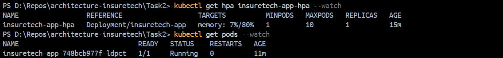
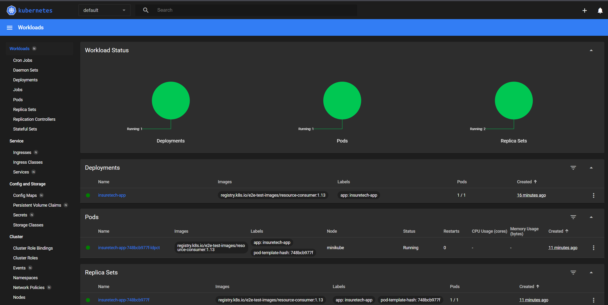

# Task 2 — Динамическое масштабирование контейнеров

## Содержимое директории

| Файл | Описание |
|------|----------|
| `deployment.yaml` | Deployment для тестового приложения (1 реплика, лимит памяти 30Mi) |
| `service.yaml` | NodePort Service для доступа к приложению (порт 8080) |
| `hpa.yaml` | HorizontalPodAutoscaler — масштабирование по памяти (80%, макс. 10 реплик) |
| `locustfile.py` | Сценарий нагрузочного тестирования Locust |

---

## Шаги выполнения

### 1. Запуск Minikube и включение metrics-server

```bash
minikube start
minikube addons enable metrics-server
```

### 2. Применение манифестов

```bash
kubectl apply -f deployment.yaml
kubectl apply -f service.yaml
kubectl apply -f hpa.yaml
```

### 3. Проверка состояния

```bash
kubectl get deployments
kubectl get pods
kubectl get svc
kubectl get hpa
```

### 4. Получение URL сервиса

```bash
minikube service insuretech-app --url
```

### 5. Нагрузочное тестирование

Установить Locust:
```bash
pip install locust
```

Запустить Locust из директории с `locustfile.py`:
```bash
locust
```

Открыть веб-интерфейс: http://localhost:8089

Указать:
- **Number of users** — например, 100
- **Spawn rate** — например, 10
- **Host** — URL из шага 4

### 6. Наблюдение за масштабированием

```bash
# Смотреть за состоянием HPA в реальном времени
kubectl get hpa insuretech-app-hpa --watch

# Смотреть за подами
kubectl get pods --watch

# Дашборд Minikube
minikube dashboard
```



---

## Тесты

### Unit-тесты (статическая валидация манифестов)

Проверяют корректность YAML-манифестов и сценария Locust без запущенного кластера.

```bash
cd Task2
uv run --with pytest --with pyyaml --with pytest-cov pytest -v --color=yes
```

📄 [Лог запуска unit-тестов](tests/run-20260301_192613.log)

### Интеграционные тесты (живой Minikube)

Проверяют реальное состояние кластера: ноды, поды, HPA, метрики.

```bash
bash run_integration_tests.sh --skip-scaling
```

📄 [Лог запуска интеграционных тестов](tests/integration-run-20260301_212536.log)

### Общий лог pytest (последний запуск)

📄 [tests/test-results.log](tests/test-results.log)

---

## Конфигурация HPA

- **Метрика:** потребление оперативной памяти (memory)
- **Целевая утилизация:** 80% от лимита (30Mi × 0.8 = 24Mi)
- **Минимальное количество реплик:** 1
- **Максимальное количество реплик:** 10